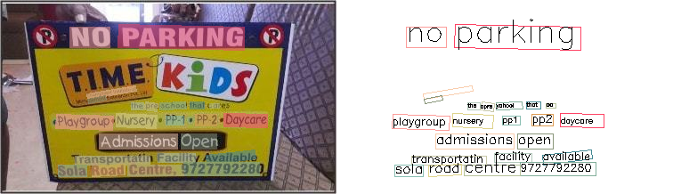

# Introduction

GeneralOCR is open source Optical Character Recognition based on PyTorch. It makes a fidelity and useful tool to implement SOTA models on OCR domain. You can use them to infer and train the model with your customized dataset. The solution architecture of this project is re-implemented from [facebook Detectron](https://github.com/facebookresearch/Detectron) and [openmm-cv](https://github.com/open-mmlab/mmcv).


# Installation

Refer to the guideline of [gen_ocr installation](docs/install.md)

# Inference
## Configuration
### Model text detection

Supported Algorithms:

<details open>
<summary>Text Detection</summary>

| Algorithm      | Paper | Python argument (--det) |
| :---        |    :----:   | ---: |
|- [x] [DBNet](configs/textdet/dbnet/README.md) (AAAI'2020) |https://arxiv.org/pdf/1911.08947|  DB_r18, DB_r50|
|- [x] [Mask R-CNN](configs/textdet/maskrcnn/README.md) (ICCV'2017)|https://arxiv.org/abs/1703.06870|MaskRCNN_CTW, MaskRCNN_IC15, MaskRCNN_IC17|
|- [x] [PANet](configs/textdet/panet/README.md) (ICCV'2019)|https://arxiv.org/abs/1908.06391|PANet_CTW, PANet_IC15|
|- [x] [PSENet](configs/textdet/psenet/README.md) (CVPR'2019)|https://arxiv.org/abs/1903.12473|PS_CTW, PS_IC15|
|- [x] [TextSnake](configs/textdet/textsnake/README.md) (ECCV'2018)|https://arxiv.org/abs/1807.01544|TextSnake|
|- [x] [DRRG](configs/textdet/drrg/README.md) (CVPR'2020)|https://arxiv.org/abs/2003.07493|DRRG|
|- [x] [FCENet](configs/textdet/fcenet/README.md) (CVPR'2021)|https://arxiv.org/abs/2104.10442|FCE_IC15, FCE_CTW_DCNv2|

</details>

**Table 1**: Text detection algorithms, papers and arguments configuration in package.

### Model text recognition

<details open>
<summary>Text Recognition</summary>

| Algorithm      | Paper | Python argument (--recog) | 
| :---        |    :----:   |---:|
|- [x] [CRNN](configs/textrecog/crnn/README.md) (TPAMI'2016)|https://arxiv.org/abs/1507.05717| CRNN, CRNN_TPS |
|- [x] [NRTR](configs/textrecog/nrtr/README.md) (ICDAR'2019)|https://arxiv.org/abs/1806.00926| NRTR_1/8-1/4, NRTR_1/16-1/8|
|- [x] [RobustScanner](configs/textrecog/robust_scanner/README.md) (ECCV'2020)|https://arxiv.org/abs/2007.07542| RobustScanner |
|- [x] [SAR](configs/textrecog/sar/README.md) (AAAI'2019)|https://arxiv.org/abs/1811.00751| SAR |
|- [x] [SATRN](configs/textrecog/satrn/README.md) (CVPR'2020 Workshop on Text and Documents in the Deep Learning Era)|https://arxiv.org/abs/1910.04396| SATRN, SATRN_sm | 
|- [x] [SegOCR](configs/textrecog/seg/README.md) (Manuscript'2021)|-| SEG |

</details>

**Table 2**: Text recognition algorithms, papers and arguments configuration in package.

## Inference

```shell
# Activate your conda environment
conda activate gen_ocr
python general_ocr/utils/ocr.py demo/demo_text_ocr_2.jpg --print-result --imshow --det TextSnake --recog SEG
```
`--det` and `--recog` argument values are supplied in **table 1** and **table 2**.

The result as below:



# Training

## Training with toy dataset

We prepare toy datasets for you to train on `/tests/data` folder in which you can do your experiment before training with the official datasets.

```
python tools/train.py configs/textrecog/robust_scanner/seg_r31_1by16_fpnocr_toy_dataset.py --work-dir seg
```

To change text recognition algorithm into `sag`:

```
python tools/train.py configs/textrecog/sar/sar_r31_parallel_decoder_toy_dataset.py --work-dir sar
```

## Training with Academic dataset

When you train Academic dataset, you need to setup dataset directory as this guideline. The main point you should forecus is that your model point to the right dataset directory. Assume that you want to train model `TextSnake` on `CTW1500` dataset, thus your config file of that model in `configs/textdet/textsnake/textsnake_r50_fpn_unet_1200e_ctw1500.py` should be as below:

```
dataset_type = 'IcdarDataset'
data_root = 'data/ctw1500/'


data = dict(
    samples_per_gpu=4,
    workers_per_gpu=4,
    val_dataloader=dict(samples_per_gpu=1),
    test_dataloader=dict(samples_per_gpu=1),
    train=dict(
        type=dataset_type,
        ann_file=f'{data_root}/instances_training.json',
        img_prefix=f'{data_root}/imgs',
        pipeline=train_pipeline),
    val=dict(
        type=dataset_type,
        ann_file=f'{data_root}/instances_test.json',
        img_prefix=f'{data_root}/imgs',
        pipeline=test_pipeline),
    test=dict(
        type=dataset_type,
        ann_file=f'{data_root}/instances_test.json',
        img_prefix=f'{data_root}/imgs',
        pipeline=test_pipeline))
```

Your data_root folder `data/ctw1500/` have to be right. Afterward, train your model:

```shell
python tools/train.py configs/textdet/textsnake/textsnake_r50_fpn_unet_1200e_ctw1500.py --work-dir textsnake
```

To study other configuration parameters on [training](docs/training.md).

# Testing

Now you completed training of TextSnake and get the checkpoint `textsnake/lastest.pth`. You should evaluate peformance on test set using `hmean-iou` metric:

```shell
python tools/test.py configs/textdet/textsnake/textsnake_r50_fpn_unet_1200e_ctw1500.py textsnake/latest.pth --eval hmean-iou
```

# Model details

* **Design pattern**: Each type of object such as `dataset, encoder, decoder, backbone, layer, model, loss` is registered according to group and scope context according to idea of [facebook-detectron](https://detectron2.readthedocs.io/en/v0.2.1/tutorials/write-models.html).

* **Layers**: Layers architecture and pretrained-models is mainly refered from [open-mmcv](https://github.com/open-mmlab/mmcv).

# Next plane

* **Implements**: Paddle-OCR, TR-OCR, TessaractOCR.

# Citation

If you find this project is useful in your reasearch, kindly consider cite:

```
@article{genearal_ocr,
    title={GeneralOCR:  A Comprehensive package for OCR models},
    author={khanhphamdinh},
    email= {phamdinhkhanh.tkt53.neu@gmail.com},
    year={2021}
}
```

